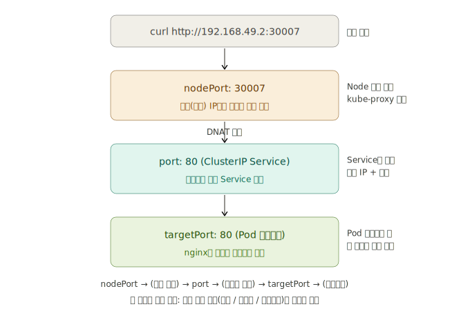
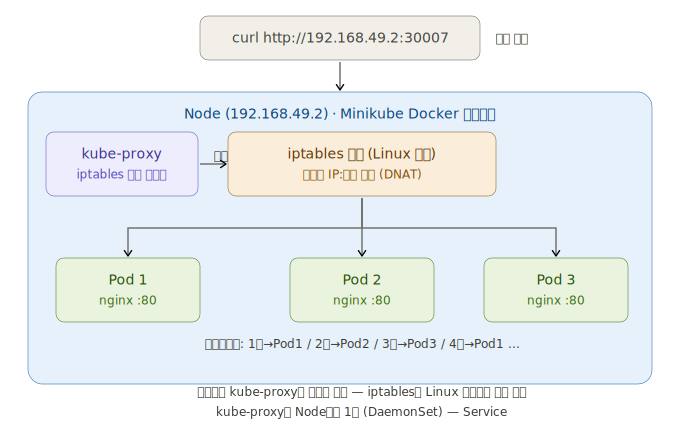

# Minikube 네트워크 구조와 Service 동작 원리

이 문서는 Kubernetes를 처음 배우는 사용자를 대상으로 Minikube 환경에서 Service가 어떻게 동작하는지 단계별로 설명합니다. 개념 중심, 흐름 중심으로 정리되어 있으며, 주요 항목은 접어서 펼칠 수 있습니다.

> 개념을 다 읽었다면 [문제 풀러 가기](#문제)

## 요약

Minikube는 로컬 환경에서 Kubernetes 클러스터를 실행하는 도구입니다. Service는 Pod를 외부 또는 내부 네트워크에 연결하며, NodePort는 노드 IP에 외부 포트를 여는 방식입니다.

<details><summary>핵심 개념</summary>

### 1. Minikube 네트워크 구조

Minikube에서는 여러 네트워크 인터페이스가 동시에 존재합니다.

1. `lo` : 시스템 내부 통신용 루프백
2. `enp0s3` : VM이 외부와 통신하는 실제 NIC
3. `docker0` : 일반 Docker 브리지
4. `br-...` : Minikube 전용 브리지
5. `veth...` : 호스트와 Minikube 컨테이너를 연결하는 가상 NIC

실제 연결 관계는 다음과 같습니다.

```
호스트 192.168.49.1 ←→ [veth 페어] ←→ Minikube 노드 192.168.49.2
         br-f43e28a734f9 브리지
```

### 2. Service 포트 구조

`kubectl get svc` 출력의 `80:30500/TCP`은 다음을 의미합니다.

1. `80` : `port` — Service가 클러스터 내부에서 받는 포트
2. `30500` : `nodePort` — 노드 IP에서 외부로 개방된 포트
3. `TCP` : 프로토콜

이 구조는 다음과 같이 정리됩니다.

```
노드IP:nodePort 에서 ClusterIP:port 를 거쳐 Pod IP:targetPort 로 전달
```

### 3. 포트의 역할

1. `port` : Service가 클러스터 내부에서 받는 포트
2. `targetPort` : 실제 컨테이너가 사용하는 포트
3. `nodePort` : 노드 IP에서 외부로 개방된 포트

</details>

<details><summary>요청 흐름</summary>

### 요청 처리 순서

1. 외부 요청이 `192.168.49.2:30500`으로 도달
2. kube-proxy가 iptables/IPVS 규칙으로 목적지 변경(DNAT)
3. ClusterIP `10.99.96.62:80`으로 전달
4. 실제 nginx Pod의 `80` 포트로 전달
5. 응답이 다시 사용자에게 반환

### curl 테스트 결과

1. `curl http://192.168.49.2:30500` : 성공
2. `curl http://192.168.49.2:80` : 실패
3. `curl http://192.168.49.2` : 실패

이유는 노드 자체가 80번 포트를 리슨하지 않기 때문입니다. Pod 내부에서만 80번 포트를 사용합니다.

</details>

<details><summary>ClusterIP</summary>

ClusterIP는 실제 네트워크 인터페이스가 아닙니다. kube-proxy는 Service 생성 시 iptables 규칙을 작성하여 가상 IP로 들어온 요청을 실제 Pod로 전달합니다.

예를 들면 다음과 같습니다.

```
목적지 10.99.96.62:80 에서 실제 Pod IP:80 으로 전달
```

따라서 ClusterIP는 실체가 없는 가상 계층이며, Pod가 교체되어도 서비스 주소는 유지됩니다.

</details>

<details><summary>Minikube 실습 구조</summary>

Minikube는 Docker 컨테이너 또는 VM 하나로 Kubernetes 클러스터를 실행합니다. 이 컨테이너가 Kubernetes Node 역할을 수행합니다.



실습 환경은 다음과 같습니다.

```
Ubuntu VM(server01)
└── Minikube Node(Docker Container)
    ├── nginx Pod 1
    ├── nginx Pod 2
    └── nginx Pod 3
```

1. VM IP : `10.0.2.15`
2. Minikube Node IP : `192.168.49.2`
3. nginx Service : `10.99.96.62:80`(ClusterIP)
4. 외부 접근 포트 : `30500`(NodePort)



</details>

## 실습 단계 요약

1. 클러스터 시작

```bash
minikube status
minikube start
```

2. Deployment 생성

```bash
kubectl create deployment nginx --image=nginx --replicas=3
kubectl get all
```

3. Service 생성

```bash
kubectl expose deployment nginx --type=NodePort --port=80
kubectl get svc
```

4. 외부 접근 확인

```bash
minikube ip
curl http://192.168.49.2:30500
```

5. Port Forward

```bash
kubectl port-forward service/nginx 80:80
curl http://127.0.0.1:80
```

6. 스케일링

```bash
kubectl scale deployment nginx --replicas=5
kubectl get pods -o wide
```

## 그림으로 보는 흐름



## 정리

`NodePort`는 외부에서 노드 IP로 접속할 때 사용하는 포트이고, `ClusterIP`는 클러스터 내부에서 사용하는 가상 IP이며, `targetPort`는 실제 Pod 컨테이너의 포트입니다.

이제 `80:30500` 형태의 의미와, 노드 IP에서 바로 80번 포트로 접근하면 실패하는 이유를 이해할 수 있습니다.

<a id="문제"></a>

<details><summary>📝 문제 풀기 (위 개념을 다 읽은 후 클릭하세요)</summary>

**Q1. 쿠버네티스 Deployment는 포드 3개를 유지하도록 설정되어 있다. 실행 중 포드 하나가 장애로 인해 정지되었으나, 쿠버네티스가 이를 감지하고 즉시 새로운 포드를 생성하여 서비스의 연속성을 보장하였다. 이와 가장 관련 깊은 개념은?**

1. High Availability (고가용성)
2. High Scalability (고확장성)
3. Data Consistency (데이터 일관성)
4. Vertical Scaling (수직 확장)

**Q2. 다음 중 올바른 이름는?**

1. 쿠버네틱스
2. 큐보네틱스
3. 쿠버네티스
4. 규보네티스

**Q3. Service 설정에서 클러스터 외부의 사용자가 노드의 특정 IP와 포트를 통해 접속할 수 있도록 개방하는 포트 필드의 이름은 무엇입니까?**

1. targetPort
2. containerPort
3. nodePort
4. port

**Q4. Service가 어떤 포드 (Pod)들에게 트래픽을 보낼지 선택하기 위해 사용하는 '꼬리표' 기반의 필드는 무엇입니까?**

1. Namespace
2. Metadata
3. Annotation
4. Selector

<details><summary>정답 확인</summary>

A1. 1번 : High Availability (고가용성)
A2. 3번 : 쿠버네티스
A3. 3번 : nodePort
A4. 4번 : Selector

</details>

</details>
